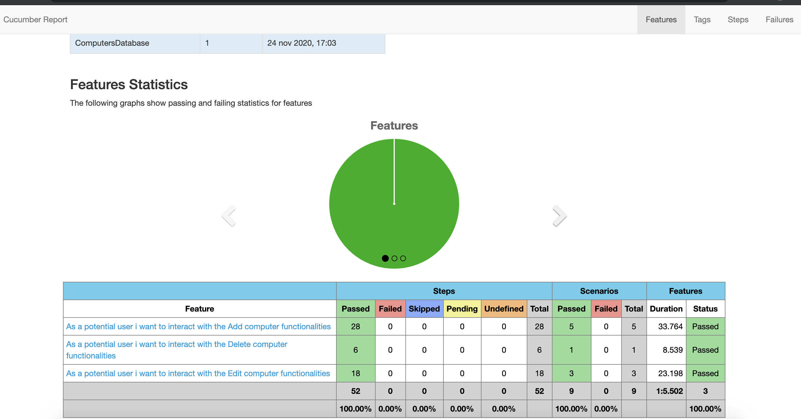
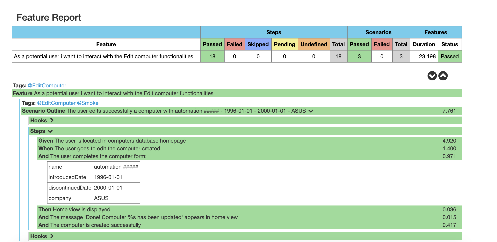
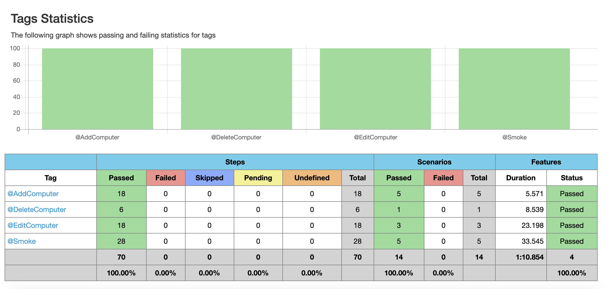

# Computers Database - Automation

## Installation
You need to have:
 * [JDK 1.8](https://www.oracle.com/ar/java/technologies/javase/javase-jdk8-downloads.html)
 * [Maven](https://maven.apache.org/download.cgi)
 * Set JAVA_HOME and MAVEN_HOME environment variables.

## How it works
We have a BDD structure, so I recommend that see first the features file, then go step after step understand his behaviour,
as well, we have in ComputerSteps additional hooks for pre-condition and post-condition (add and delete a computer via API), you can see running in the report.

## Run
### All testcases:
mvn clean test

### Only smoke:
mvn clean test "-Dcucumber.filter=-t @Smoke"

### Specific functionality:
mvn clean test "-Dcucumber.filter=-t @AddComputer"

#### Functionalities availables: 
@AddComputer @EditComputer @DeleteComputer

## Debug:
mvn clean test -DforkCount=0

## Multi browsers
By default, the framework runs with Chrome, to run with Firefox add to the mvn command line: -Pfirefox
For example: mvn clean test -Pfirefox

## Technologies used:
* Java jdk 1.8
* Maven
* Selenium
* TestNG (runner)
* Cucumber (BDD)
* Log4j (logger)
* [Bonigarcia](https://github.com/bonigarcia/webdrivermanager) (setup drivers automatically)
* [Retrofit](https://square.github.io/retrofit) (API requests for pre-conditions and post-conditions)

## Reports
The report, once we run the test, is located in target/report/overview-features.html

## Project structure
* src/test/resources/features = features files with the scenarios, gherkin and data (BDD).
* src/test/java/Hooks = hooks in general of cucumber for this project (before and after)
* src/main/resources = properties files: cucumber options, log4 and project configs (config.properties)
* src/main/java/steps = steps that matches with gherkin from features files
* src/main/java/views = interactions with the views of the application (Page factory pattern)
* src/main/java/models = modeling of particular objects with complex behaviour
* src/main/java/core = different implementations:
    * DriverService: manage the driver instance
    * ProjectTypeEnum: enum with the different types of project
    * PropertyManager: loads the properties (located in config.properties) and use them in the lifecycle
    * ScenarioContext: variables that are used in the lifecycle of the scenario
    * Utils: implementations that can be used in various circumstances
    * API
        * RetrofitManager: implementation for Retrofit library to instance a new Retrofit
        * ComputerService: interface with the different endpoints and implementations of the APIs
        
## Some explanation
My idea was to divide the functionalities into different features (Add, Edit, Delete) and for each functionality,
the interactions with this (create a new computer, attempt to create one with invalid data).
I used, for the pre-conditions and post-conditions, API interactions because if we use the UI for that, could fail.
I didn't use a lot of waits because this application is fast.
I'm always open to feedback, I think this project can be better, and you discover some problems when you add new implementations.
Is the first time I use this reporter, generally I use Extent report.